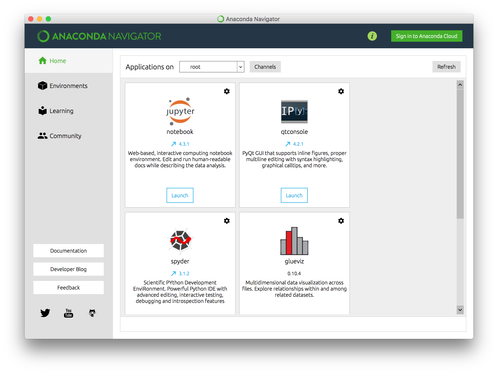
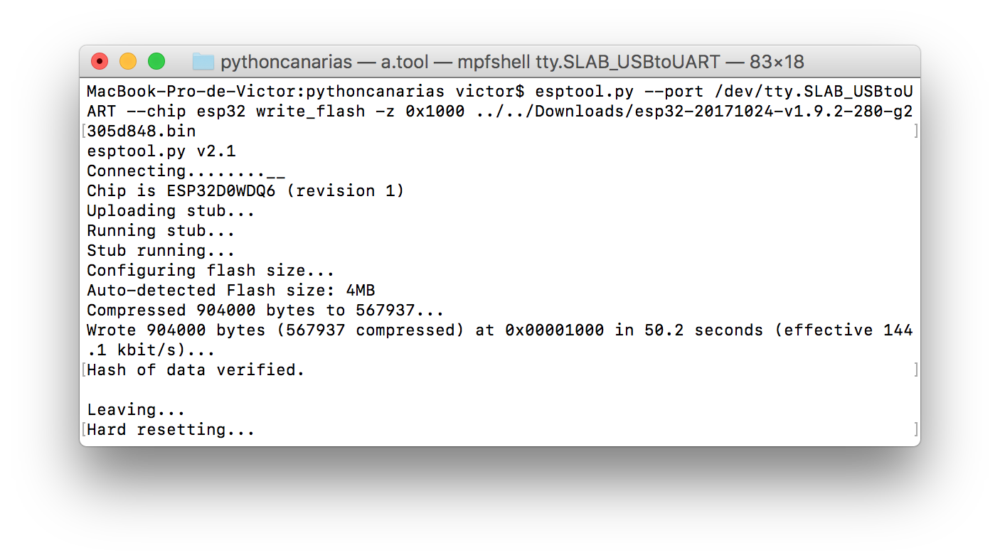

# Apéndice A: Instalación y configuración de MicroPython en la ESP32

Para poder instalar MicroPython, necesitaremos tener instalado Python 3.4 o superior. Cualquier instalación de Python sera suficiente. En nuestro caso, recomendamos utilizar [Anaconda](https://anaconda.org) el cual es una herramienta que instala python y las librerías más comunes; además de tener una serie de herramientas para poder gestionar los entornos de desarrollo.

Para poder instalar anaconda, lo descargaremos de la página oficial https://www.anaconda.com/download/ y lo instalaremos. Una vez instalado, vamos a abrir una terminal para poder utilizar nuestro entorno python. Por ello utilizaremos la herramienta de _Anaconda Navigator_.



Una vez en la aplicación vamos a la pantalla de _Enviorements_; de manera que podemos crear un entorno de desarrollo, o usar el que viene por defecto. Una vez creado, pulsaremos en el botón de "play" y pulsaremos la opción _open Terminal_.

Antes de continuar, necesitaremos instalar la herramienta _esptool_ la cual nos permitirá flashear la placa de Desarrollo ESP32. Por lo que utilizaremos _Pip_ para instalarla.

```bash
$ pip install esptool
```

## Flashear la placa de desarrollo

Una vez tenemos todo instalado ya podemos pasar a flashear la memoria de la ESP32; por lo que en primer lugar descargaremos la imagen correspondiente a nuestra placa ESP32 que puede descargarse de [http://micropython.org/download#esp32](http://micropython.org/download#esp32). Es importante descargar la imagen correspondiente a nuestro chip o placa. Por lo que descargaremos la correspondiente a la ESP32(Si tuviéramos que instalar la correspondiente a la ESP8266 se descargará la imagen de dicho chip).

Con la imagen descargada, necesitaremos tener instalado el driver correspondiente a nuestro Chip; normalmente la ESP32 o similares vienen con un controlador USB el cual dependiendo del sistema Operativo necesitaremos instalar un driver o no.

### Linux

Para los Sistemas Linux no es necesario instalar un driver ya que viene por defecto.

### MacOs

Para los sistemas MacoS necesitaremos descargar el driver que puedes descargar de [http://www.mblock.cc/docs/run-makeblock-ch340-ch341-on-mac-os-sierra/](http://www.mblock.cc/docs/run-makeblock-ch340-ch341-on-mac-os-sierra/).

### Windows

Para los sistemas Windows también es necesario descargar el driver de la dirección [http://www.wch.cn/download/CH341SER_EXE.html](http://www.wch.cn/download/CH341SER_EXE.html).

Una vez descargada la imagen e instalado el driver, pasaremos a borrar la memoria del chip con la herramienta _esptool_. Sin embargo, en función del sistema operativo que tengamos, necesitaremos instalar los drivers para que nuestro sistema detecte la placa como un puerto serie.


```bash
$ esptool.py /dev/ttyUSB1 erase_flash
```
En el comando anterior, tenemos que saber que puerto utilizar en el caso de Linux y MacOsX; pero para sistemas Windows, tenemos que utilizar el puerto COM correspondiente; el cual podemos ver en el administrador de dispositivos.

Una vez borrada la memoria del chip ya podemos flashear la imagen que hemos descargado anteriormente.

```bash
esptool.py --chip esp32 --port /dev/ttyUSB1 write_flash -z 0x1000 firmware-ESP32.bin
```




El comando anterior, flashea la imagen correspondiente a la placa con el ESP32 el cual necesita la imagen descargada y se indica que debe empezar por la dirección 0x1000 y el chip corresponde al esp32.

Si por un casual requiere el uso de la ESP8266, se usará el siguiente comando.

```bash
$ esptool.py --port /dev/ttyUSB0 --baud 460800 write_flash --flash_size=detect 0 esp8266-20170108-v1.9.2.bin
```
El comando anterior puede dar un error de timeout; por lo que recomendamos en dicho caso usar una velocidad de 115200 baudios.

## Conectar con la placa MicroPython

Para poder conectar con nuestra placa micropython necesitaremos una consola con conexión serie. Por lo que en función de nuestro sistema Operativo, utilizaremos un programa u otro. Aunque existen varias alternativas, aquí mostramos una de ellas; en función del sistema Operativo.

### Linux

Para Sistemas Operativos _GNU/Linux_ se recomienda utilizar [_Picocom_](https://github.com/npat-efault/picocom) una aplicación de simulación de terminal. Aunque la recomendamos para Linux, también puede ser exportada para MacOsX o Windows.

Para instalarlo, utilizaremos el gestor de paquetes de nuestra distribución (aunque puede ser instalada a través de su código fuente); por lo que por este caso lo instalaremos por gestor de paquetes.

```
$ sudo apt-get install picocom # Sistemas Debian
$ sudo yum install picocom #Sistemas Red Hat
```

Una vez instalado, podemos usarlo a través del puerto serie correspondiente a nuestra placa; en este caso es el mismo que para la instalación de micropython.

```
$ pycon /dev/ttyUSB0 -b 115200
```
Como vemos en el comando anterior, tenemos un parámetro -b seguido de un número; esto indica la velocidad en baudios; por defecto puede ponerse a _115200_; pero dependiendo de la placa puede establecerse velocidades mayores.

Seguidamente dejamos una serie de comandos que podemos utilizar para picocom.

* <kbd>Control</kbd>-<kbd>a</kbd> <kbd>Control</kbd>-<kbd>x</kbd> SALIR
* <kbd>Control</kbd>-<kbd>a</kbd> <kbd>Control</kbd>-<kbd>c</kbd> LOCAL ECHO
* <kbd>Control</kbd>-<kbd>d</kbd> NODEMCU SOFT REBOOT

El comando anterior, <kbd>Control</kbd>-<kbd>d</kbd> es compatible con todos los programas que veremos ya que este comando lo interpreta la placa como un reset a nivel Software.

### MacOsX

Para los Sistemas _MacOsX_ utilizaremos el comando que trae integrado [_Screen_](https://ss64.com/osx/screen.html) el cual nos permite crear una nueva consola con conexión a un puerto serie. Para ello ejecutamos el siguiente comando en una Terminal.

```
$ screen /dev/tty.wchusb1410 115200
```
Donde podemos ver que pasamos como parámetros la dirección del puerto y la velocidad en baudios; como para Linux, podemos aumentar la velocidad; pero dependerá de la placa que tengamos.

Seguidamente se establecen algunos atajos de teclado para el comando screen.

* <kbd>Control</kbd>-<kbd>a</kbd> <kbd>Control</kbd>-<kbd>k</kbd> - Termina la sesión serie.
* <kbd>Control</kbd>-<kbd>a</kbd> <kbd>Control</kbd>-<kbd>]</kbd> - Pega el contenido del portapapeles.
* <kbd>Control</kbd>-<kbd>c</kbd> -  Termina la ejecución actual.

### Windows

Para Sistemas Windows, podemos usar el conocido [Putty](http://www.putty.org); el cual nos descargaremos de su página oficial [http://www.putty.org](http://www.putty.org); y que simplemente configuraremos el puerto COM al que nos conectaremos y la velocidad tras seleccionar la opción de usar conexión serie.


Una vez conectados, ya tenemos acceso a MicroPython en el cual se nos muestra el Prompt de Python con los característicos ```>>>```.


## Conexión via Web. WEBREPL

Aunque esta sección aún no está preparada para la _ESP32_, si que esta disponible para las placas _ESP8266_; por lo que es interesante comentar esta funcionalidad de poder programar utilizando una interfaz web en vez de una interfaz serie.

Como hemos dicho en el párrafo anterior, esta funcionalidad no está aún implementada en la ESP32 por lo que este apartado es solo para las placas ESP8266 o similares.

En primer lugar, vamos a configurar el entorno y a activar dicha funcionalidad; por lo que importaremos el módulo ```webrepl_setup```; esto activara un asistente que nos preguntará si queremos añadir o no dicha funcionalidad. Pulsaremos la 'E' (Enabled) para activarla e introduciremos 2 veces una contraseña para poder acceder posteriormente.

```
import webrepl_setup
(E)nable or (D)isable WebREPL
>E
introduce Password:
re-introduce Password:
```

Una vez configurado, vamos a conectarnos a la siguiente dirección [http://micropython.org/webrepl](http://micropython.org/webrepl); la cual nos muestra una consola para poder conectarnos; sin embargo, tenemos que conectarnos vía WIFI a nuestra ESP8266; por lo que usaremos la wifi que nos crea por defecto ( Si lo hemos cambiado nos conectaremos a dicha wifi) e introducimos la contraseña que por defecto es 'micropythoN'; una vez hecho esto ya podemos usar la consola WebREPL pulsando en el botón _connect_. Nos preguntará la contraseña y nos aparecerá el Prompt de Python ```>>>```.


